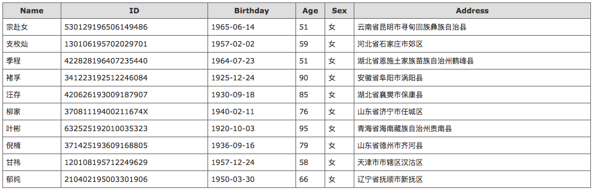

# IdentityCard

A chinese identity card generator.




## Usage

### Command

```
Usage: IdentityCard.py [options] arg1 arg2

Options:

  --version   show program's version number and exit

  -h, --help  show this help message and exit

  --num=NUM   Number of idcardnumber [default: 1]

  --min=MIN   Minimum age [default: 0]

  --max=MAX   Maximum age [default: 100]
```


### API

http://identity.daoapp.io/api

http://identity.daoapp.io/api?num=2

http://identity.daoapp.io/api?num=5&min=20

http://identity.daoapp.io/api?num=10&min=20&max=40

http://identity.daoapp.io/api?num=10&min=20&max=40&sex=1


### WEB

http://identity.daoapp.io/?num=2

http://identity.daoapp.io/?num=5&min=20

http://identity.daoapp.io/?num=10&min=20&max=40

http://identity.daoapp.io/?num=10&min=20&max=40&sex=1


